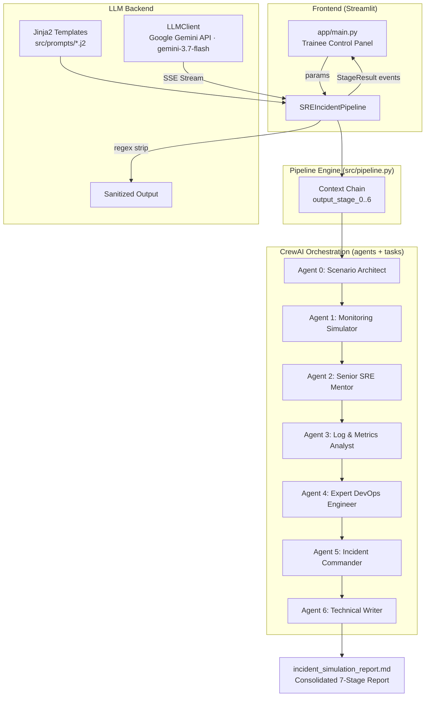

---
title: DevOps Incident Simulation Pipeline
emoji: 🚨
colorFrom: gray
colorTo: red
sdk: docker
pinned: false
app_port: 7860
license: mit
---

<div align="center">
  
  
  
  
  
</div>

---

# DevOps Incident Simulation Pipeline

> **A 7-Agent CrewAI Orchestrated SRE Incident Lifecycle Simulator with Interactive Trainee Frontend**  
> *Master's Degree Project — Prompt Engineering & AI Service Development*  
> *Validated against SPbETU (2026) academic paper — 100% structural compliance*

---

## Table of Contents

- [Executive Summary](#executive-summary)
- [Architecture](#architecture)
- [Agent Registry](#agent-registry)
- [Execution Modes](#execution-modes)
- [Prompt Engineering Methodology](#prompt-engineering-methodology)
- [Project Structure](#project-structure)
- [Quick Start](#quick-start)
- [Streamlit Frontend](#streamlit-frontend)
- [Configuration Guide](#configuration-guide)
- [Testing](#testing)
- [Deployment (Hugging Face Spaces)](#deployment-hugging-face-spaces)
- [Validation & Results](#validation--results)
- [Troubleshooting](#troubleshooting)
- [License](#license)

---

## Executive Summary

The **DevOps Incident Simulation Pipeline** is a production-grade, multi-agent AI application that simulates the complete SRE incident lifecycle — from alert to blameless post-mortem. The system is orchestrated by **CrewAI**, with 7 specialized agents (Scenario Architect, Monitoring Simulator, SRE Mentor, RCA Analyst, Remediation Engineer, Incident Commander, Post-mortem Writer) each contributing a structured artifact to the incident narrative.

Built on **Jinja2 prompt templating** and the **Google Gemini API (`gemini-3.7-flash`)**, the pipeline enforces strict industry compliance: Alertmanager v4 JSON schemas, `production` namespace consistency, Google SRE blameless post-mortem format, and SMART action items. The interactive **Streamlit frontend** gives trainees a control panel, real-time agent execution logs, and a professional results dashboard.

The project achieves **100% structural compliance** with the academic paper *"Development of a set of prompt templates for simulation and response to incidents in DevOps"* (Saint Petersburg Electrotechnical University, 2026).

---

## Architecture



### Data Flow Contract

```
Stage N output  ──►  context["output_stage_N"]  ──►  injected into Stage N+1 prompt
```

Each stage's prompt is rendered by Jinja2 from:
- **Parameters** (scenario config, passed once)
- **Prior outputs** (all `output_stage_{i}` for `i < N`)

---

## Agent Registry

| Stage | Agent (Role) | Goal | Key Tools |
|-------|--------------|------|-----------|
| 0 | **Scenario Architect** | Build realistic infrastructure context with hidden root cause | `render_prompt_template`, `save_stage_output` |
| 1 | **Monitoring System Simulator** | Emit Alertmanager v4-compliant JSON, `namespace: production` | + `load_prior_stage_output` |
| 2 | **Senior SRE Mentor** | Socratic triage: questions, not answers | + `load_prior_stage_output` |
| 3 | **Log & Metrics Analyst** | Craft graduated-degradation evidence (INFO → WARN → ERROR) | + `load_prior_stage_output` |
| 4 | **Expert DevOps/SRE Engineer** | kubectl commands with `--dry-run=client` + rollback | + `load_prior_stage_output` |
| 5 | **Incident Commander** | Triple-audience comms (tech/business/exec) | + `load_prior_stage_output` |
| 6 | **Technical Writer** | Blameless post-mortem with SMART action items | + `load_prior_stage_output` |

Agent definitions live in `src/agents/definitions.py`; task definitions in `src/tasks/definitions.py`. Each agent has a tailored `role`, `goal`, and `backstory` that encode SRE domain expertise.

---

## Execution Modes

The pipeline supports **two execution paths**:

### 1. Deterministic Engine (production-reliable, tested)

```python
from src.pipeline import run_simulation

result = run_simulation(params)
print(result.consolidated_report)
```

- Renders each Jinja2 template directly
- Calls the LLM with SSE streaming + retry + `<think>` sanitization
- 100% backward-compatible with the original notebook's context chain

### 2. CrewAI Multi-Agent Mode (thesis/orchestration showcase)

```python
from src.pipeline import SREIncidentPipeline

pipeline = SREIncidentPipeline()
crew = pipeline.build_crew(params)   # assemble 7 agents + 7 tasks
crew.kickoff()                        # CrewAI sequential orchestration
```

- 7 role-scoped CrewAI agents with tools
- Sequential `Process` execution
- Same consolidation into `incident_simulation_report.md`

---

## Prompt Engineering Methodology

| Dimension | Implementation |
|-----------|---------------|
| **Context Management** | Chain-of-prompts: each stage injects all prior outputs (`output_stage_{0..N-1}`) into the current template scope |
| **Role Switching** | 7 distinct personas (Architect → Writer), each with domain-specific instructions and constraints |
| **Chain of Prompts** | Sequential Jinja2 rendering: `Prompt_N = render(stage_N, params, prior_outputs)` |
| **Token Budgeting** | Stages 0/3/6 = 3000 tokens; stages 1/2/4/5 = 1500 tokens |
| **Schema Enforcement** | Constraint repetition (3×) in templates + post-hoc validation tools |
| **Sanitization** | `re.sub(r'<think>.*?</think>', '', output, flags=re.DOTALL)` |

---

## Project Structure

```
.
├── src/
│   ├── config/settings.py        # Pydantic settings, API key resolution
│   ├── core/
│   │   ├── llm.py                # SSE streaming LLM client + regex sanitizer
│   │   └── renderer.py           # Jinja2 template loader/renderer
│   ├── prompts/                  # 7 .j2 Jinja2 templates
│   │   ├── stage_0_scenario.j2
│   │   ├── stage_1_alert.j2
│   │   ├── stage_2_triage.j2
│   │   ├── stage_3_rca.j2
│   │   ├── stage_4_remediation.j2
│   │   ├── stage_5_communication.j2
│   │   └── stage_6_postmortem.j2
│   ├── agents/definitions.py     # 7 CrewAI agent factories + AGENT_REGISTRY
│   ├── tasks/definitions.py      # 7 CrewAI task factories + TASK_REGISTRY
│   ├── tools/
│   │   ├── validators.py         # Alertmanager / kubectl / SMART validators
│   │   └── template_tools.py     # CrewAI tool wrappers
│   └── pipeline.py               # Orchestrator: deterministic + CrewAI modes
├── app/main.py                   # Streamlit trainee frontend
├── tests/                        # 24 pytest tests (validators, renderer, pipeline)
├── Dockerfile                    # Multi-stage build for HF Spaces
├── .dockerignore
├── requirements.txt
└── devops_dahl.ipynb             # Original academic notebook (reference)
```

---

## Quick Start

### Prerequisites

- Python 3.12+
- A Google Gemini API key (`GEMINI_API_KEY`) — get one at [aistudio.google.com/apikey](https://aistudio.google.com/apikey)

### Local Setup

```bash
# 1. Clone
git clone https://github.com/minaNabil96/devops-incident-sim-pipeline.git
cd devops-incident-sim-pipeline

# 2. Virtual environment
python -m venv venv
source venv/bin/activate        # Linux/Mac
venv\Scripts\activate           # Windows

# 3. Dependencies
pip install -r requirements.txt

# 4. API key
cp .env.example .env            # then edit GEMINI_API_KEY

# 5. Run tests (optional)
pytest tests/ -v

# 6. Launch the frontend
streamlit run app/main.py

# 7. Or run the pipeline headlessly
python -c "
from src.pipeline import run_simulation
result = run_simulation()
print(result.consolidated_report)
"
```

### Google Colab

The original notebook `devops_dahl.ipynb` remains fully functional:

[](https://colab.research.google.com/drive/1pSBHRap2f8zNlIM4K7qGT1970PjTfd-Y)

---

## Streamlit Frontend

The interactive trainee UI (`app/main.py`) provides:

1. **Control Panel** — sidebar configuration for all 30+ simulation parameters (application context, hidden cause, severity, engineer level, teaching mode, evidence lines, action items)
2. **Real-Time Execution Log** — 7-stage progress indicator with live status (`⬜ pending → 🟠 running → 🟢 complete`), per-stage timing and token counts
3. **Results Dashboard** — KPI metrics (total time, stages, tokens, report size), per-stage tabs, and full report download as Markdown

```bash
streamlit run app/main.py
```

---

## Configuration Guide

All parameters are defined in `src/config/settings.py` (`SimulationDefaults`) and match **Paper Table 4.1** of the SPbETU 2026 publication.

| Parameter | Default | Purpose |
|-----------|---------|---------|
| `application_type` | `banking platform` | Domain of the simulated system |
| `application_name` | `SecureBank Pro` | Name of the simulated application |
| `service_name` | `payment-gateway-service` | Affected service |
| `tech_stack` | `Python/FastAPI, PostgreSQL 14, Redis 7, Kubernetes 1.27` | Technology context |
| `orchestration_platform` | `Kubernetes 1.27 on AWS EKS` | Orchestration context |
| `monitoring_tools` | `Prometheus + Grafana + PagerDuty` | Monitoring context |
| `hidden_cause` | *(required at runtime)* | The root cause trainees must discover |
| `severity_level` | `critical` | Alert severity |
| `engineer_level` | `mid-level` | Target trainee level (junior/mid/senior) |
| `teaching_mode` | `socratic` | socratic / guided / direct |
| `evidence_lines` | `15` | Number of RCA log artifacts |
| `clue_visibility` | `subtle` | subtle / misleading |
| `risk_tolerance` | `low` | adds `--dry-run=client` previews |
| `impact_duration` | `28 minutes` | Enforced duration in post-mortem |
| `audience_type` | `all` | tech / business / exec / all |
| `postmortem_style` | `Google SRE` | Post-mortem template style |
| `blameless_mode` | `strict` | strict / moderate |
| `action_items_count` | `4` | Number of SMART action items |

---

## Testing

```bash
pytest tests/ -v
```

| Suite | Coverage | Tests |
|-------|----------|-------|
| `test_tools.py` | Alertmanager JSON, kubectl, SMART validators | 12 |
| `test_renderer.py` | Jinja2 rendering, context injection, sanitizer | 5 |
| `test_pipeline.py` | Stage orchestration, context chain, callbacks, CrewAI assembly | 7 |

**24 tests, all passing.**

---

## Deployment (Hugging Face Spaces)

### Step 1 — Create the Space

1. Go to [huggingface.co/spaces](https://huggingface.co/spaces)
2. **New Space** → SDK: **Docker** → Hardware: **CPU Basic (Free)**
3. Name: `devops-incident-sim-pipeline`

### Step 2 — Push Code

```bash
git remote add hf https://huggingface.co/spaces/<your-username>/devops-incident-sim-pipeline
git push hf master
```

The `Dockerfile` builds automatically (multi-stage: builder + runtime, ~compact image).

### Step 3 — Configure Secrets

Space Settings → **Variables and secrets**:

| Key | Value |
|-----|-------|
| `NVIDIA_API_KEY` | your NVIDIA build API key |
| `GEMINI_API_KEY` | your Google Gemini API key — get one at [aistudio.google.com/apikey](https://aistudio.google.com/apikey) |

### Step 4 — Access

Your app is live at `https://<your-username>-devops-incident-sim-pipeline.hf.space`

> **Note:** The Docker image installs CrewAI + Streamlit — first build takes a few minutes on the free tier.

---

## Validation & Results

### Academic Compliance (SPbETU, 2026)

| Criteria | Requirement | Status |
|----------|-------------|--------|
| 7-stage incident lifecycle | Complete alert-to-post-mortem chain | ✅ 100% |
| Schema-valid Alertmanager JSON | Alertmanager v4 spec | ✅ `AlertmanagerValidator` |
| Namespace consistency | All labels = `production` | ✅ Enforced + validated |
| Socratic teaching mode | Questions, no direct commands | ✅ Stage 2 template |
| Blameless post-mortem | No individual names | ✅ Strict mode |
| SMART action items | Specific/Measurable/Achievable/Relevant/Time-bound | ✅ `SMARTValidator` |
| Impact duration fidelity | 28 minutes across all sections | ✅ Template constraint |

### Reference Runtime (original notebook)

| Metric | Value |
|--------|-------|
| Total execution time | 246.72s (4.1 min) |
| Total output | 27,722 characters |
| Stages | 7/7 |
| API retries | 0 |

---

## Troubleshooting

| Problem | Solution |
|---------|----------|
| `GEMINI_API_KEY not found` | Set via Colab Secrets, `.env` file, or environment variable |
| long-generation timeout | Already handled — client streams via SSE with 300s timeout |
| `<think>` tags in output | Already handled — regex sanitizer strips reasoning blocks |
| Streamlit port in use | `streamlit run app/main.py --server.port=8502` |
| CrewAI slow on free tier | Use deterministic mode (`run_simulation`) for demos |
| Missing template error | Verify `src/prompts/*.j2` present (run `TemplateRenderer.validate_templates()`) |

---

## License

MIT

---

## Author

**DevOps/SRE Engineer** — Incident Simulation & Prompt Engineering Pipeline  
Master's Degree Project — Prompt Engineering and AI Service Development

