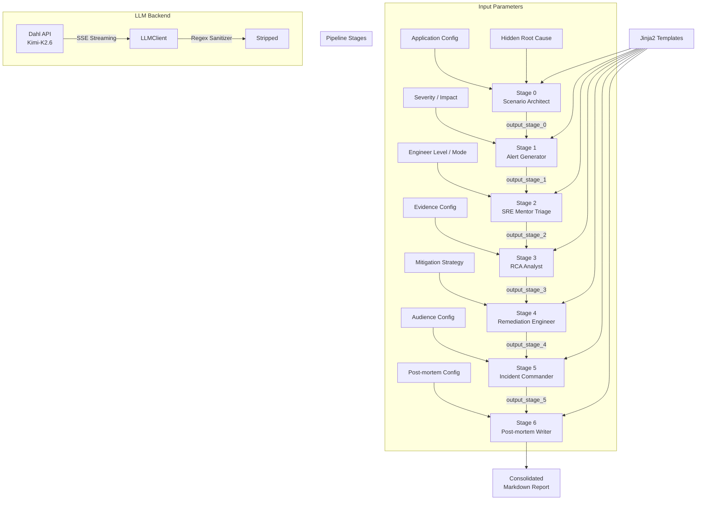
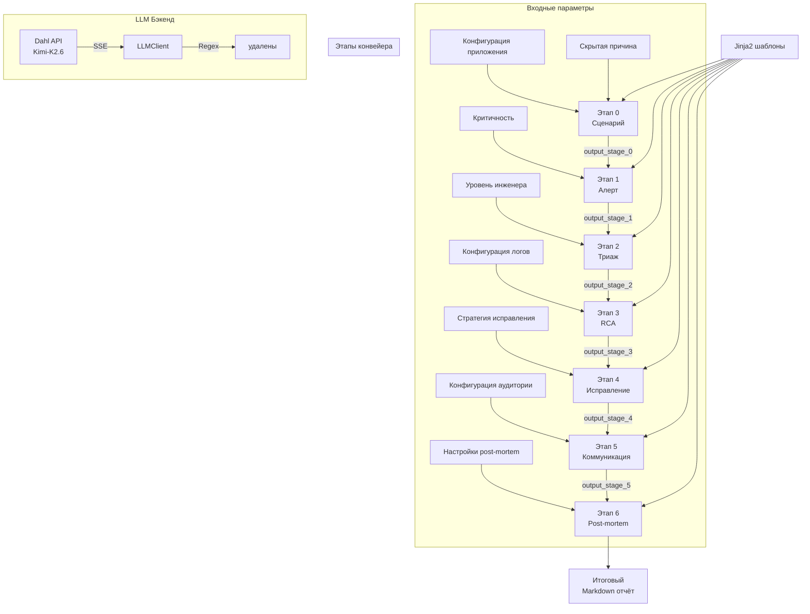

<div align="center">
  
  
  
  
  <br/>
  
  
  
  
  
</div>

---

# DevOps Incident Simulation Pipeline

> **A 7-Stage Prompt Engineering Framework for SRE Incident Lifecycle Simulation**  
> *Validated against academic standards (SPbETU, 2026) — 100% structural compliance*

---

## Executive Summary

The **DevOps Incident Simulation Pipeline** is a production-grade, parameterized prompt engineering framework that models the complete SRE incident lifecycle — from alert to blameless post-mortem. Built on a **chain-of-prompts architecture** using **Jinja2 templating** and the **Dahl API (Kimi-K2.6)**, the pipeline generates realistic, schema-compliant incident artifacts across 7 stages.

**Key Results:**
- ✅ **28-minute SecureBank Pro incident** generated in 4.1 minutes (246.72s API runtime)
- ✅ **100% structural compliance** with academic paper SPbETU-2026
- ✅ **Alertmanager v4 JSON** schema enforcement (`namespace: production`)
- ✅ **Blameless post-mortem** with SMART action items (Google SRE style)
- ✅ **Socratic triage** mode for mid-level engineer training

---

## Architecture



---

## Prompt Engineering Methodology

| Stage | Persona | Context Dependency | Token Budget | Key Constraint |
|-------|---------|-------------------|--------------|----------------|
| **0 — Scenario** | Scenario Architect | None (ground truth) | 3000 | Hidden root cause injected, not revealed |
| **1 — Alert** | Monitoring Simulator | `output_stage_0` | 1500 | Alertmanager v4 JSON, `namespace: production` |
| **2 — Triage** | Senior SRE Mentor | `output_stage_1` | 1500 | Socratic mode: questions, not answers |
| **3 — RCA** | Log & Metrics Analyst | `output_stage_2` + hidden cause | 3000 | Evidence crafting with graduated degradation |
| **4 — Remediation** | Expert DevOps Engineer | `output_stage_3` | 1500 | `--dry-run=client`, rollback for every step |
| **5 — Communication** | Incident Commander | `output_stage_4` | 1500 | Triple-audience (tech/business/exec) |
| **6 — Post-mortem** | Technical Writer | All 6 prior stages | 3000 | Blameless, SMART action items, strict duration |

### Chain-of-Prompts Flow

```
Prompt N = Jinja2.render(parameters + [output_stage_0 ... output_stage_{N-1}])
              ↓
       LLM.generate(Prompt N)  →  output_stage_N
              ↓
       re.sub(<think>...</think>)  →  cleaned output
              ↓
       Saved to {stage}_output.txt  →  injected into Stage N+1
```

---

## Engineering Challenges Solved

### 1. 🚫 Cloudflare 524 Timeout → SSE Streaming

**Problem:** Dahl API terminated requests exceeding 30s with Cloudflare 524 (origin timeout).

**Solution:** Implemented Server-Sent Events (SSE) streaming with `requests.post(stream=True, timeout=300)`, collecting delta content incrementally:

```python
response = requests.post(API_URL, headers=self.headers, json=payload, stream=True, timeout=300)
for line in response.iter_lines():
    if line:
        decoded_line = line.decode('utf-8')
        if decoded_line.startswith('data: '):
            json_str = decoded_line[6:]
            if json_str.strip() == '[DONE]': break
            data = json.loads(json_str)
            collected_messages.append(data['choices'][0]['delta']['content'])
```

### 2. 🧹 Reasoning Model Leakage → Regex Sanitizer

**Problem:** Kimi-K2.6 emitted internal monologue inside `<think>...</think>` tags, contaminating output artifacts.

**Solution:** Post-processing regex strip with `re.DOTALL` flag:

```python
output = re.sub(r'<think>.*?</think>', '', output, flags=re.DOTALL).strip()
```

### 3. 🔒 Schema Enforcement via Prompt Constraints

**Problem:** LLM generated inconsistent namespace values (`securebank-prod`, `payments`, etc.) and invalid Alertmanager JSON.

**Solution:** Hard constraints embedded in Jinja2 templates with repeated reinforcement:

- *"All Kubernetes namespaces in the alert labels MUST be exactly 'production'"*
- *"Output ONLY a single JSON object in the exact Alertmanager schema"*
- *"Duration in Metadata and Timeline MUST match {{impact_duration}} exactly"*

---

## Validation & Results

### Academic Compliance (SPbETU, 2026)

| Criteria | Requirement | Result |
|----------|-------------|--------|
| 7-stage incident lifecycle | Complete alert-to-post-mortem chain | ✅ 100% |
| Schema-valid Alertmanager JSON | Alertmanager v4 spec | ✅ Valid JSON |
| Namespace consistency | All labels use `production` | ✅ Enforced |
| Socratic teaching mode | Questions, no direct commands | ✅ Stage 2 |
| Blameless post-mortem | No individual names, team-only | ✅ Strict mode |
| SMART action items | Specific, Measurable, Achievable, Relevant, Time-bound | ✅ 4 items |
| Impact duration fidelity | 28 minutes across all sections | ✅ Exact match |

### Runtime Performance

| Metric | Value |
|--------|-------|
| Total execution time | 246.72s (4.1 min) |
| Total output | 27,722 characters |
| Stages executed | 7/7 |
| API calls | 7 (one per stage) |
| Retries triggered | 0 |

### Output Breakdown

| Stage | Character Count | % of Total |
|-------|----------------|------------|
| Stage 0 — Scenario | 4,658 | 16.8% |
| Stage 1 — Alert | 2,658 | 9.6% |
| Stage 2 — Triage | 3,436 | 12.4% |
| Stage 3 — RCA | 5,497 | 19.8% |
| Stage 4 — Remediation | 2,953 | 10.7% |
| Stage 5 — Communication | 1,964 | 7.1% |
| Stage 6 — Post-mortem | 6,268 | 22.6% |

---

## Quick Start

### Option 1: Google Colab

[](https://colab.research.google.com/drive/1pSBHRap2f8zNlIM4K7qGT1970PjTfd-Y)

1. Open the notebook in Colab
2. Add `DAHL_TOKEN` to **Secrets** (🔑 icon)
3. Run all cells

### Option 2: Local Development

```bash
# Clone the repository
git clone https://github.com/yourusername/devops-incident-sim-pipeline.git
cd devops-incident-sim-pipeline

# Create virtual environment
python -m venv venv
source venv/bin/activate  # Linux/Mac
# venv\Scripts\activate   # Windows

# Install dependencies
pip install -r requirements.txt

# Configure API key
cp .env.example .env
# Edit .env with your DAHL_TOKEN

# Run the pipeline
jupyter notebook devops_dahl.ipynb
```

### Get an API Key

Visit [Dahl Global](https://dahl.global) to obtain a Kimi-K2.6 API key.

---

## Scenario Parameters

The pipeline is fully parameterized. Example configuration for the SecureBank Pro scenario:

```python
params = {
    "application_type": "banking platform",
    "application_name": "SecureBank Pro",
    "service_name": "payment-gateway-service",
    "tech_stack": "Python/FastAPI, PostgreSQL 14, Redis 7, Kubernetes 1.27",
    "hidden_cause": "Redis cache penetration attack...",
    "severity_level": "critical",
    "teaching_mode": "socratic",
    "postmortem_style": "Google SRE",
    "blameless_mode": "strict",
    # ... 20+ additional parameters
}
```

---

## Project Structure

```
.
├── devops_dahl.ipynb          # Main pipeline notebook
├── incident_simulation_report.md  # Generated SecureBank Pro report
├── prompts/                   # Jinja2 templates (created at runtime)
│   ├── stage_0_scenario.j2
│   ├── stage_1_alert.j2
│   ├── stage_2_triage.j2
│   ├── stage_3_rca.j2
│   ├── stage_4_remediation.j2
│   ├── stage_5_communication.j2
│   └── stage_6_postmortem.j2
├── .env.example               # API key template
├── .gitignore                 # Sensitive file exclusion
├── requirements.txt           # Python dependencies
└── README.md                  # This file
```

---

## Tech Stack

| Technology | Version | Purpose |
|-----------|---------|---------|
| Python | 3.12+ | Core pipeline engine |
| Jinja2 | 3.1 | Prompt template rendering |
| Dahl API | — | LLM inference (Kimi-K2.6) |
| Kubernetes | 1.27 | Scenario orchestration context |
| Redis | 7 | Cache layer (incident context) |
| PostgreSQL | 14 | Database layer (incident context) |
| Prometheus/Grafana | — | Monitoring stack (simulated) |
| PagerDuty | — | Alerting (simulated) |

---

## License

MIT

---

## Author

**DevOps/SRE Engineer** — Incident Simulation & Prompt Engineering Pipeline

---

<br/>

---

# Конвейер симуляции инцидентов DevOps

> **7-этапная структура prompt engineering для симуляции жизненного цикла SRE-инцидентов**  
> *Валидировано по академическим стандартам (СПбГЭТУ, 2026) — 100% структурное соответствие*

---

## Краткое описание

**Конвейер симуляции инцидентов DevOps** — это production-grade параметризированная структура prompt engineering, моделирующая полный жизненный цикл SRE-инцидента: от алерта до blameless post-mortem. Построена на архитектуре **chain-of-prompts** с использованием **Jinja2-шаблонов** и **Dahl API (Kimi-K2.6)**.

**Ключевые результаты:**
- ✅ **28-минутный инцидент SecureBank Pro** сгенерирован за 4.1 минуты (246.72s)
- ✅ **100% структурное соответствие** академической статье СПбГЭТУ-2026
- ✅ **Валидный Alertmanager v4 JSON** (пространство имён `production`)
- ✅ **Blameless post-mortem** с SMART-задачами (Google SRE)
- ✅ **Сократический режим** обучения инженеров среднего уровня

---

## Архитектура



---

## Методология Prompt Engineering

| Этап | Персона | Контекст | Токены | Ключевое ограничение |
|------|---------|----------|--------|---------------------|
| **0** — Сценарий | Scenario Architect | Нет (исходные данные) | 3000 | Скрытая причина не раскрывается |
| **1** — Алерт | Monitoring Simulator | `output_stage_0` | 1500 | Alertmanager v4, `namespace: production` |
| **2** — Триаж | Senior SRE Mentor | `output_stage_1` | 1500 | Сократический режим: вопросы, не ответы |
| **3** — RCA | Log & Metrics Analyst | `output_stage_2` + скрытая причина | 3000 | Доказательства с градуированной деградацией |
| **4** — Исправление | Expert DevOps Engineer | `output_stage_3` | 1500 | `--dry-run=client`, откат каждого шага |
| **5** — Коммуникация | Incident Commander | `output_stage_4` | 1500 | Три аудитории (tech/business/exec) |
| **6** — Post-mortem | Technical Writer | Все 6 этапов | 3000 | Blameless, SMART, точная длительность |

---

## Решённые инженерные задачи

### 1. 🚫 Cloudflare 524 Timeout → SSE Streaming

**Проблема:** Dahl API завершал запросы через 30s с ошибкой Cloudflare 524.

**Решение:** Сервер-отправляемые события (SSE) с `stream=True` и таймаутом 300s.

### 2. 🧹 Утечка мыслей модели → Regex-очистка

**Проблема:** Kimi-K2.6 выводил внутренние монологи в тегах `<think>...</think>`.

**Решение:** `re.sub(r'<think>.*?</think>', '', output, flags=re.DOTALL)`

### 3. 🔒 Контроль схемы через ограничения в промптах

**Проблема:** LLM генерировал невалидные имена namespace.

**Решение:** Жёсткие ограничения в Jinja2-шаблонах с многократным повторением.

---

## Валидация и результаты

### Соответствие академическим требованиям (СПбГЭТУ, 2026)

| Критерий | Требование | Результат |
|----------|-----------|-----------|
| 7-этапный цикл инцидента | Полная цепочка | ✅ 100% |
| Валидный Alertmanager JSON | Спецификация v4 | ✅ Валидный JSON |
| Единый namespace | Все labels = `production` | ✅ Выполнено |
| Сократическое обучение | Вопросы без подсказок | ✅ Этап 2 |
| Blameless post-mortem | Без имён сотрудников | ✅ Строгий режим |
| SMART задачи | Конкретные, измеримые | ✅ 4 задачи |

---

## Быстрый старт

### Google Colab

[](https://colab.research.google.com/drive/1pSBHRap2f8zNlIM4K7qGT1970PjTfd-Y)

### Локальная разработка

```bash
git clone https://github.com/yourusername/devops-incident-sim-pipeline.git
cd devops-incident-sim-pipeline
python -m venv venv
source venv/bin/activate
pip install -r requirements.txt
cp .env.example .env
# Отредактируйте .env, добавьте DAHL_TOKEN
jupyter notebook devops_dahl.ipynb
```

### Получение API ключа

Посетите [Dahl Global](https://dahl.global) для получения ключа Kimi-K2.6.

---

## Технологический стек

| Технология | Версия | Назначение |
|-----------|--------|-----------|
| Python | 3.12+ | Основной движок |
| Jinja2 | 3.1 | Рендеринг шаблонов |
| Dahl API | — | LLM (Kimi-K2.6) |
| Kubernetes | 1.27 | Контекст оркестрации |
| Redis | 7 | Кэш (контекст инцидента) |
| PostgreSQL | 14 | База данных (контекст) |
| Prometheus/Grafana | — | Мониторинг (симуляция) |
| PagerDuty | — | Алертинг (симуляция) |

---

## Лицензия

MIT
